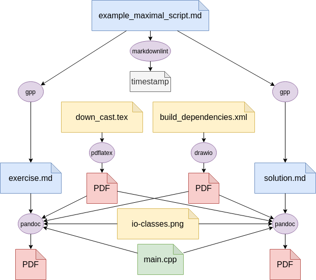

docmake
=======

CMake modules to integrate pandoc and other tools for code like document compilation.

Introduction
------------

This project helps to generate consistent documents
that depend not only on one single input file but e.g. on generated images.
CMake is then responsible to track the file dependencies
and triggers the generation of all parts in the correct order
to finally integrate all parts into the complete document.

In addition the use of markdown let the user focus on writing content
and not on formatting or compilation.

Main features
-------------

* Create consistent documents from `markdown` or any other format supported by `pandoc`.
* Manage content similar to code with `git` and `cmake`.
* Integrate generated images (`drawio`, `tikz`) directly into the final PDF.
* Preprocess source files with a general purpose preprocessor (`gpp`).
  * Include common settings/parts to each document. E.g. a title sheet.
  * Manage multiple versions of one part in the same source file with `#if` and `#else` clauses.
    E.g. for exercises with a separate solution document.
* Lint your markdown source files with `markdownlint` to ensure a consistent style.

Quick start
-----------

This project mainly provides the cmake modules that are used to setup document projects.
To install those modules on the OS simply configure and trigger the `install` target:

~~~
mkdir build
cd build
cmake ..
sudo make install
~~~

After that you can use the different modules as expected with:

~~~
find_package(docmake)
include(docmake/pandoc)
include(docmake/markdownlint)
...
~~~

An alternative to system wide installation
is to integrate the [modules](./modules) folder directly in your project.
You can then reference it by setting the `CMAKE_MODULE_PATH` accordingly instead of use `find_package(docmake)`.

All the tools that are executed by these cmake modules need to be installed separately.
See the [examples.yml](.github/workflows/examples.yml) github workflow for an example of the used tools.
Or use the companion [ansible-role-docmake](https://github.com/langchr86/ansible-role-docmake)
to install the needed tools with ansible.

The output of these examples can also be downloaded here in the [releases](https://github.com/langch86/docmake/releases)

To see the most up to date output of these examples compile it yourself:

~~~
mkdir build
cd build
cmake .. -DDOCMAKE_ENABLE_MINIMAL_EXAMPLE=ON -DDOCMAKE_ENABLE_MAXIMAL_EXAMPLE=ON
make
~~~

Run with docker
----------
~~~
cp .env-example .env
docker-compose run --rm docmake 
~~~

Usage guide
-----------

This list points out some useful steps or tips for the usage of these modules.

* Take the examples as base and customize them for your own projects.
* These modules can also be combined with other workflows in your toolchain.
  E.g. this can be very useful to have the documentation directly in code projects that are managed by cmake anyway.
  Like this lines of real code files can be easily integrated in the documents with `\lstinputlisting`.
* Ensure to reload cmake if you add new files if globbing is used in cmake (like the examples do).
* Use a good PDF viewer that support live update of changed files. E.g. `okular`.
* All output files are located in the build folder.
  Like this it is easy to completely clean the compilation output by deleting the build folder.
  In addition the logs generated by some generation steps are located next to the output files.
* The pandoc module and all others can be parametrized with many optional things.
  E.g. see the documentation of [pandoc_document](modules/docmake/pandoc.cmake).

CMake options
-------------

See the main [CMakeLists.txt](./CMakeLists.txt) file for all available cmake options
and the default settings.

Examples explanation
--------------------

*(or a short introduction into dependency management with `cmake`)*

The provided examples should primarily show the minimal setup that can be used
but in addition the possibilities that are available in a full blown setup.
And even this maximal setup could be extended even more to use e.g. more advanced pandoc features or options.

CMake at its heart is no compiler but it triggers arbitrary compilers or similar tools
to convert input files to compiled output files.
But the main problem CMake solves is the dependency management that is needed to schedule each compilation step.
This is because multiple compilation steps may be connected
because of the second step needs the output of the first one as input.
In addition it supports incremental builds
by detecting which input files have been changed or added since the last build
and trigger only the compilation steps that are needed to update the output files accordingly.

To visualize such dependencies the following diagram shows the maximum examples dependencies.

Similar projects
----------------

Projects with similar approaches or similar goals but did not met our needs.
Most of the time the possibility to combine other compilation steps (image rendering) or preprocessing.

* [cmake-pandocology](https://github.com/jeetsukumaran/cmake-pandocology)
* [Markdown-CMake-Pandoc](https://github.com/gismo141/Markdown-CMake-Pandoc)

License
-------

MIT

Versioning
----------

There are no version numbers, releases, tags or branches.
The master should be considered the current stable release.
All other existing branches are feature/development branches and are considered unstable.

Author Information
------------------

Christian Lang: [lang.chr86@gmail.com](mailto:lang.chr86@gmail.com)
